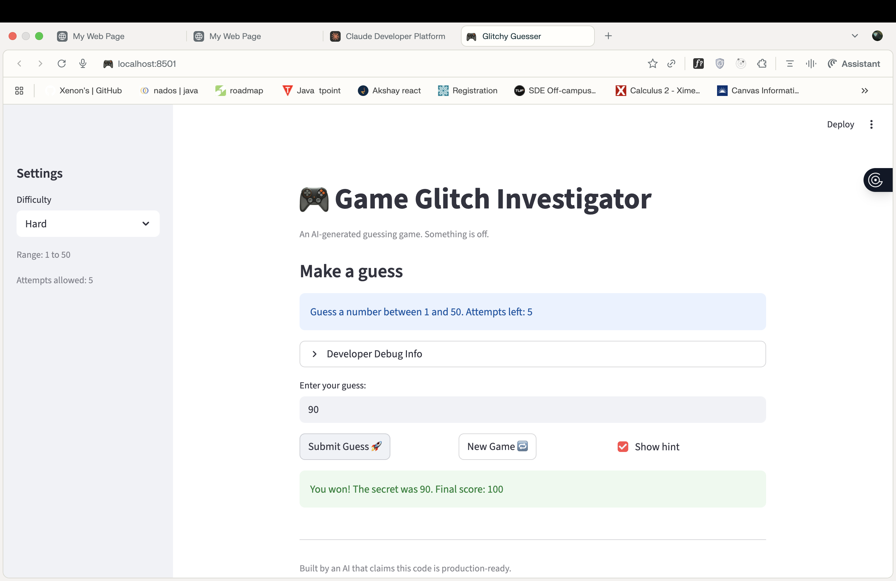
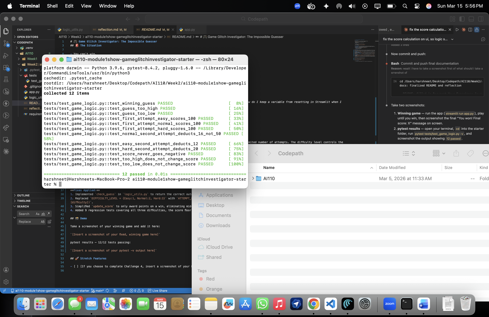

# 🎮 Game Glitch Investigator: The Impossible Guesser

## 🚨 The Situation

You asked an AI to build a simple "Number Guessing Game" using Streamlit.
It wrote the code, ran away, and now the game is unplayable. 

- You can't win.
- The hints lie to you.
- The secret number seems to have commitment issues.

## 🛠️ Setup

1. Install dependencies: `pip install -r requirements.txt`
2. Run the broken app: `python -m streamlit run app.py`

## 🕵️‍♂️ Your Mission

1. **Play the game.** Open the "Developer Debug Info" tab in the app to see the secret number. Try to win.
2. **Find the State Bug.** Why does the secret number change every time you click "Submit"? Ask ChatGPT: *"How do I keep a variable from resetting in Streamlit when I click a button?"*
3. **Fix the Logic.** The hints ("Higher/Lower") are wrong. Fix them.
4. **Refactor & Test.** - Move the logic into `logic_utils.py`.
   - Run `pytest` in your terminal.
   - Keep fixing until all tests pass!

## 📝 Document Your Experience

**Game Purpose:**
This is a number guessing game where the player tries to guess a randomly generated secret number within a limited number of attempts. The difficulty level controls the number range and how many guesses you get. Each wrong guess before winning deducts points, so the fewer attempts you use, the higher your final score.

**Bugs Found:**
1. **Backwards hints** — `check_guess` returned "Go LOWER" when the guess was too low and "Go HIGHER" when too high, the exact opposite of correct behavior. This made the game unwinnable through normal play.
2. **Broken score deduction** — `update_score` divided 100 by a difficulty rank (1/2/3) instead of the actual attempt limit, so Normal mode deducted 50 pts per wrong guess instead of the correct 16.
3. **`check_guess` not implemented in `logic_utils.py`** — the function was a stub raising `NotImplementedError`, which caused all three starter pytest tests to fail immediately.
4. **Score updated on wrong guesses** — the original code added/deducted points mid-game on every wrong guess instead of only computing points at the moment of winning.

**Fixes Applied:**
1. Implemented `check_guess` in `logic_utils.py` to return the correct outcome string (`"Win"`, `"Too High"`, `"Too Low"`), matching the test expectations.
2. Replaced `DIFFICULTY_LEVEL = {Easy:1, Normal:2, Hard:3}` with `ATTEMPT_LIMIT = {Easy:8, Normal:6, Hard:5}` and computed `deduction_per_wrong = int(100 / ATTEMPT_LIMIT[difficulty])`.
3. Simplified `update_score` to only award points on a win, eliminating mid-game score drift from wrong guesses.
4. Added 9 regression tests covering all three difficulties, the score floor at 0, and wrong-guess no-ops — all 12 tests now pass.

## 📸 Demo

pytest results — 12/12 tests passing:

## 🚀 Stretch Features

- [ ] [If you choose to complete Challenge 4, insert a screenshot of your Enhanced Game UI here]
